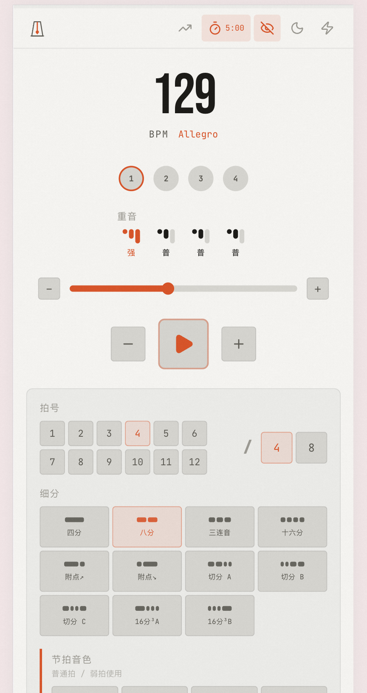

# Klick

**A precision web metronome built for musicians who care about timing.**

No install. No signup. Just open and play.

[**README in Chinese / 中文文档**](./README.zh-CN.md)

<div align="center">
  
</div>

---

## Why Klick?

Most online metronomes feel like toys — laggy clicks, no subdivisions, no accent control. Klick uses the Web Audio API's lookahead scheduling to deliver **sub-millisecond timing accuracy**, the same technique used in professional DAWs. Everything runs client-side, works offline after first load, and saves your settings automatically.

## Features

**Core**
- Sub-millisecond timing via Web Audio API lookahead scheduler
- Tap Tempo — tap any key or button to set BPM
- BPM range 1–300, adjustable via slider, keyboard, scroll wheel, or direct input

**Rhythm**
- Any time signature (2/4, 3/4, 4/4, 5/4, 7/8, ...)
- 12 subdivision patterns — quarter, eighth, triplet, sixteenth, dotted, syncopated, quintuplet, and more
- Per-beat accent editor — cycle through accent / normal / ghost / mute per beat

**Sound**
- Multiple click tones with separate accent sound selection
- Volume control with one-click mute

**Practice Tools**
- Tempo Trainer — auto-increment BPM every N bars to build speed progressively
- Timer — countdown practice sessions, auto-stops when time is up
- Flash Mode — full-screen visual pulse, great for stage or distance viewing

**Themes & Skins**
- Dark / Light theme
- 6 skins — Default, Ocean, Forest, Minimal, Pixel (retro 8-bit), Classical (concert-hall)
- Each skin provides unique colors, fonts, and decorative elements

**Internationalization**
- 3 languages — Chinese, English, Japanese
- One-click language switching in the header, preference saved across sessions

**Quality of Life**
- Visual mute — turn off all beat animations while keeping audio
- Keyboard shortcuts (Space, arrows, Esc)
- Wake Lock — screen stays on while playing (mobile)
- All settings persisted to localStorage — pick up right where you left off

## Quick Start

```bash
npm install
npm run dev
```

Open [http://localhost:3000](http://localhost:3000).

```bash
# Production
npm run build && npm start
```

## Keyboard Shortcuts

| Key | Action |
|-----|--------|
| `Space` | Play / Stop |
| `↑` / `↓` | BPM ±1 |
| `Shift + ↑/↓` | BPM ±5 |
| `Esc` | Exit Flash Mode |

## Tech Stack

| Layer | Tech |
|-------|------|
| Framework | [Next.js 16](https://nextjs.org/) (App Router) |
| UI | [React 19](https://react.dev/) + [Tailwind CSS v4](https://tailwindcss.com/) |
| Audio | [Web Audio API](https://developer.mozilla.org/en-US/docs/Web/API/Web_Audio_API) — zero dependencies |
| Icons | [Lucide React](https://lucide.dev/) |
| Language | TypeScript |

## Project Structure

```
src/
├── app/              # Next.js app entry, layout, global styles
├── components/
│   └── metronome/    # UI: BpmDisplay, BeatVisualizer, TransportBar, ...
├── hooks/            # useMetronome, useTapBpm, useKeyboard, useSkin, ...
├── i18n/             # Internationalization — translations (zh/en/ja), context
├── lib/
│   ├── audio/        # AudioEngine, lookahead scheduler, sound definitions
│   └── skins/        # Skin definitions, registry, theme variables
└── types/            # Shared TypeScript types
```

## License

MIT
